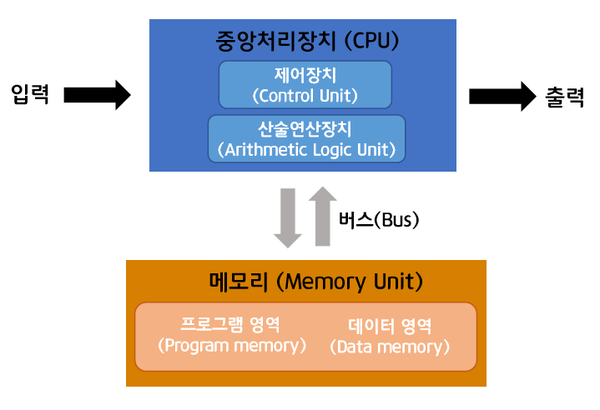

# 컴퓨터 동작 원리

---

## 강의 reference

[앨런 Swift문법 마스터 스쿨 (온라인 BootCamp - 2개월과정)](https://www.inflearn.com/course/스위프트-문법-마스터-스쿨/dashboard)

---

<br>

## 내 정리 참조

[컴퓨터구조-링크](https://korshika.tistory.com/category/CS%20%EC%A7%80%EC%8B%9D/%E2%97%8B%20CA%28Computer%20Architecture%29)

[컴퓨터OS-링크](https://korshika.tistory.com/category/CS%20%EC%A7%80%EC%8B%9D/%E2%97%8B%20OS%28Operating%20System%29?page=2)

### 1) 폰노이만 구조

[참조링크](https://m.blog.naver.com/with_msip/221981730449)



- 정의

  ```text
  폰 노이만 구조는 중앙처리장치(CPU), 메모리, 프로그램 세 가지 요소로 구성되어 있습니다.
  위 그림처럼 CPU와 메모리는 서로 분리되어 있고 둘을 연결하는 버스를 통해 명령어 읽기, 데이터의 읽고 쓰기가 가능합니다. 이때 메모리 안에 프로그램과 데이터 영역은 물리적 구분이 없기 때문에 명령어와 데이터가 같은 메모리, 버스를 사용하게 됩니다.
  다시 말해, 외나무다리와 같은 버스를 통해 CPU가 명령어와 데이터에 동시 접근할 수 없습니다.
  ```

- 장점

  ```text
  이 구조의 가장 큰 장점은 프로그램 내장 방식 컴퓨터라는 점입니다.

  예시를 통해 쉽게 설명해보겠습니다.
  이전 컴퓨터는 1+1, 3-2 라는 두 가지의 명령을 수행하려면 하드웨어의 전선을 직접 1, 더하기, 1, 3, 빼기, 2를 의미하는 것으로 매번 바꿔 끼워 입력해야 했습니다.

  그러나 폰 노이만 구조에서는 더하기, 빼기 기능을 담은 소프트웨어가 메모리 안에 내장되어 있습니다. 그래서 계산이 필요할 때마다 메모리 안의 프로그램과 데이터를 CPU에 전달하여 계산을 처리합니다.

  여기서 CPU가 메모리에 저장된 명령어를 받아와 계산할 때 메모리로부터 명령어를 가져오는 fetch, 명령어의 의미를 해석하는 decode, 명령어를 실행하는 execute, 결과를 저장하는 store의 순서로 처리됩니다. 또한 폰 노이만 구조는 ‘내장 메모리 순차처리 방식’을 따르고 있기 때문에 CPU는 순차적으로 한 번에 명령어 하나씩 실행합니다.
  ```

- 특징
  - 메모리에 적재된 것 자체가 `프로세스`
  - 프로그래밍, 컴파일(스크립트언어 제외인듯?), 기계어 변환, 메모리 적재, 연산 수행의 과정을 거침
  - 메모리 주소를 통해 Ram 값 읽고 쓰는 것을 반복

### 2) 폰노이만 구조에서의 RAM

- [내글 정리 링크1](https://korshika.tistory.com/135)
- [내글 정리 링크2](https://korshika.tistory.com/132)
