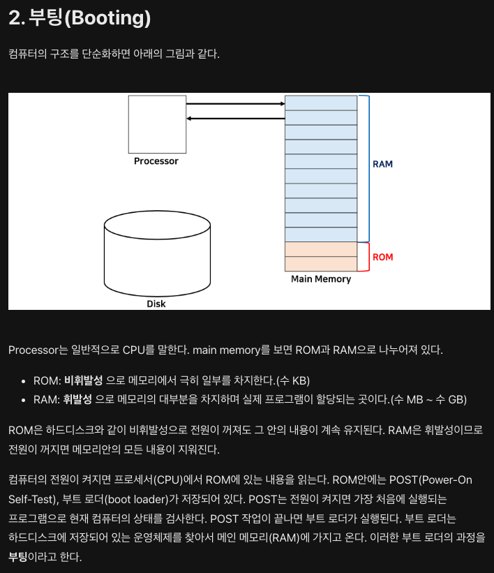
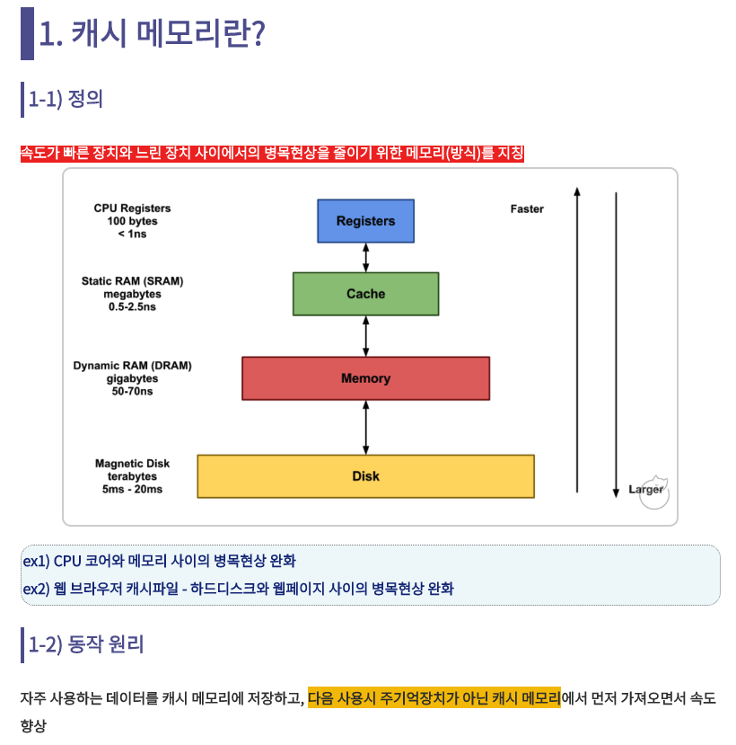

# CPU와 메모리 동작

---

## 강의 reference

[앨런 Swift문법 마스터 스쿨 (온라인 BootCamp - 2개월과정)](https://www.inflearn.com/course/스위프트-문법-마스터-스쿨/dashboard)

---

 

## 내 정리 참조

[컴퓨터구조-링크](https://korshika.tistory.com/category/CS%20%EC%A7%80%EC%8B%9D/%E2%97%8B%20CA%28Computer%20Architecture%29)

[컴퓨터OS-링크](https://korshika.tistory.com/category/CS%20%EC%A7%80%EC%8B%9D/%E2%97%8B%20OS%28Operating%20System%29?page=2)

### 1) 내 정리

[CPU 연산과정](https://korshika.tistory.com/125)

### 2) CPU / 주메모리 동작 과정

- 과정
  1. 주메모리 프로그램 적재; 코드가 적재
  2. CPU 명령어 수행
     1. 제어장치; 어떤 명령어 수행할지 제어
     2. 연산장치; 실제 연산
  3. 주메모리에 결과 저장; 때로는 출력장치에 전달
  4. 2 ~ 3 과정 반복

### 3) OS 운영체제

- 특징
  - OS의 주메모리 상주 부분이 커널
  - 항시 동작하며 CPU / 메모리 관리, I/O 등을 조정
  - 이 부분과 응용SW 들이 모두 동작시 주메모리에 올라와있음
- 기 Process

  - ROM으로 체크; 보조메모리 OS를 주메모리에 적재
    - POST; 자기자신 점검
    - ROM bios
    - 부팅

- 참조

  - [참조 링크](https://velog.io/@codemcd/%EC%9A%B4%EC%98%81%EC%B2%B4%EC%A0%9COS-1.-%EC%9A%B4%EC%98%81%EC%B2%B4%EC%A0%9C%EB%9E%80)

    

### 4) 캐시

- [내정리 링크](https://korshika.tistory.com/124)

  

### 5) 언어 수준 종류
1) 기계어; 기계 이해 언어
2) 어샘어; 기계어 1차 변환되어 읽을 수 있는 언어; 컴파일시 output의 일종으로 확인 가능
3) 고급어; 실제 인간이 작성, 컴파일시 기계어변환