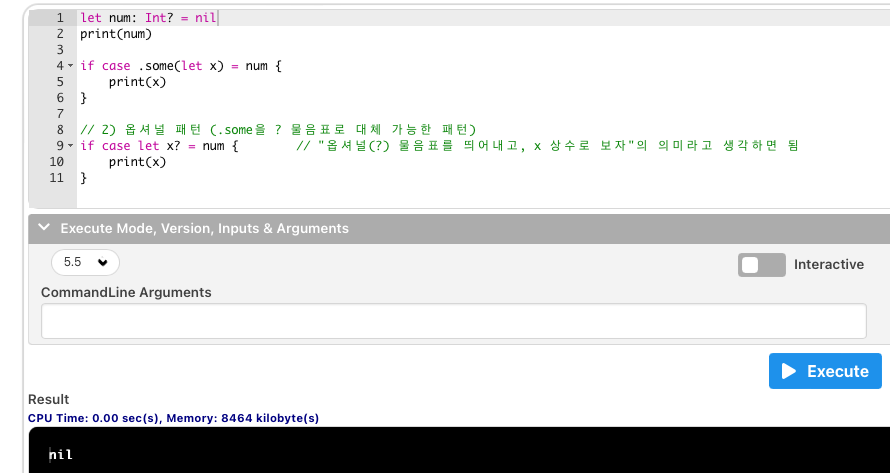

# 옵셔널 패턴

---

## 강의 reference

[앨런 Swift문법 마스터 스쿨 (온라인 BootCamp - 2개월과정)](https://www.inflearn.com/course/스위프트-문법-마스터-스쿨/dashboard)

---

<br>

### 참조

### 특징

- some, nil의 enum의 case 문법 가져와서 사용  
  

- 즉, `some 이어서 실제 값이 들어가 있는 1개의 case를 편하게 unwrapping하기 위한 문법`

### 1) 기존 옵셔널의 case 패턴

```swift
let a: Int? = 1

// 1) 열거형 케이스 패턴 (앞에서 배운)
switch a {
case .some(let z):
    print(z)
case .none:  // nil이라고 써도됨
    print("nil")
}
```

### 2) 지금 단원에서 살펴볼 옵셔널 패턴

```swift
let a: Int? = 1

switch a {
case let z?:      // .some을 조금 더 간소화하는 문법    let z? = Optional.some(a)
    print(z)                                //   => let z  = a
case nil:         // .none 이라고 써도됨
    print("nil")
}
```

### 3) if문 enum case 문법도 간소화 가능

```swift
let num: Int? = 7
print(num)

if case .some(let x) = num {
    print(x)
}

// 2) 옵셔널 패턴 (.some을 ? 물음표로 대체 가능한 패턴)
if case let x? = num {        // "옵셔널(?) 물음표를 띄어내고, x 상수로 보자"의 의미라고 생각하면 됨
    print(x)
}

```

### 4) for문 enum case 문법도 간소화 가능

- 옵셔널 타입을 포함하는 배열에서 반복문을 사용하는 경우, 옵셔널 패턴을 사용하면 편리함

```swift
let arrays: [Int?] = [nil, 2, 3, nil, 5]


// 1) 열거형 케이스 패턴
for case .some(let number) in arrays {
    print("Found a \(number)")
}


// 2) 옵셔널 패턴
for case let number? in arrays {
    print("Found a \(number)")
}

```
