# 앱만들기 주요버튼, 화면소개

---

## 강의 reference

[앨런 Swift문법 마스터 스쿨 (온라인 BootCamp - 2개월과정)](https://www.inflearn.com/course/스위프트-문법-마스터-스쿨/dashboard)

---

 

### 참조

### 특징

### 1) 기본 세팅

- 커버하는 버전 범위(대응범위) 설정
  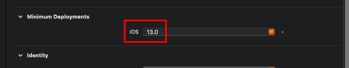
- 앱의 배포한 os 선택 가능
  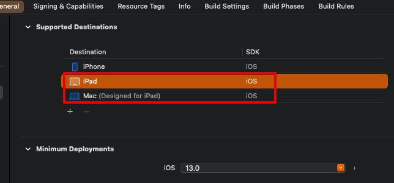
- 화면 방향 전환
  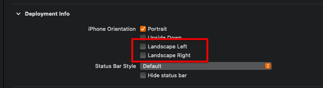
- 어트리뷰트 인스펙터
  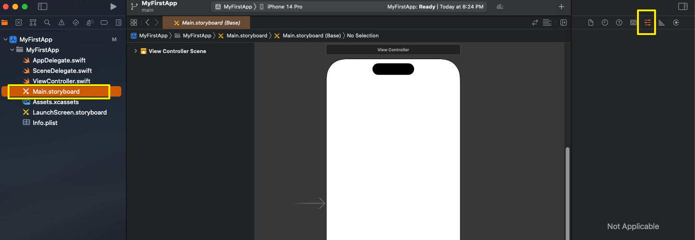
- 사이즈 인스펙터
  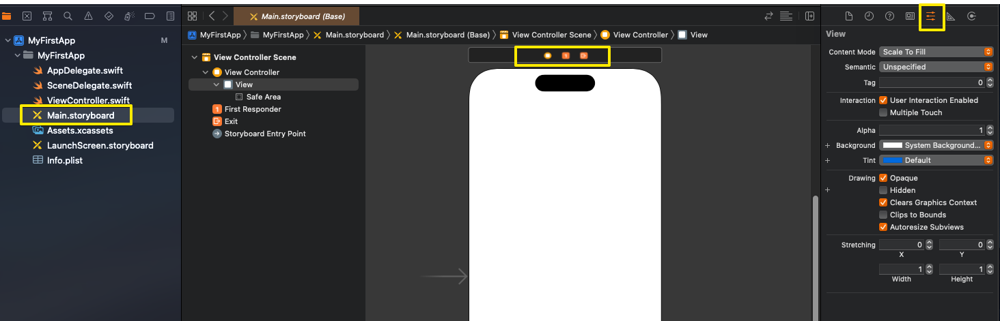
- 다큐먼트 아웃라인 ( 경계면 보여주는 영역 )
  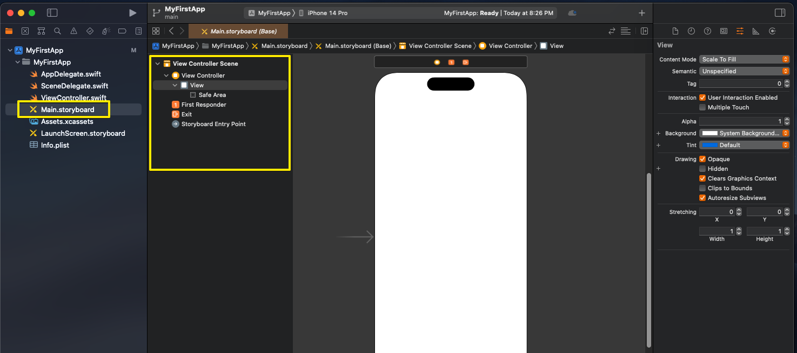
- 디버깅 영역 - 개발시
  - `command + shift + Y`
    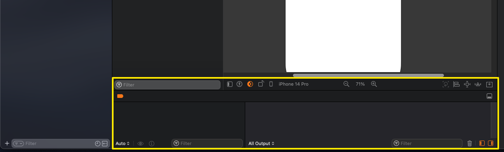
- 라이브러리 기능
  - object 가져다가 놓을 수 있게 됨
  - `command + shift + L`
    
- object 영역 설정하는 부분
  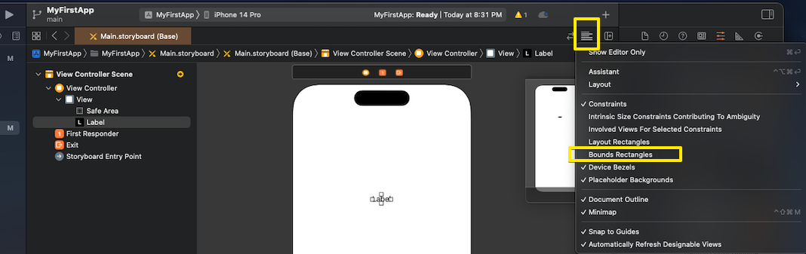
- 코드를 같이 보여주는 assistance
  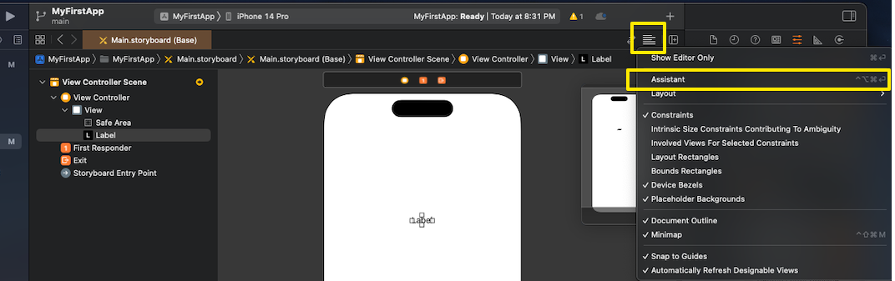  
  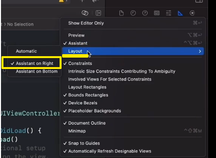
- storyboard 혹은 interface builder
  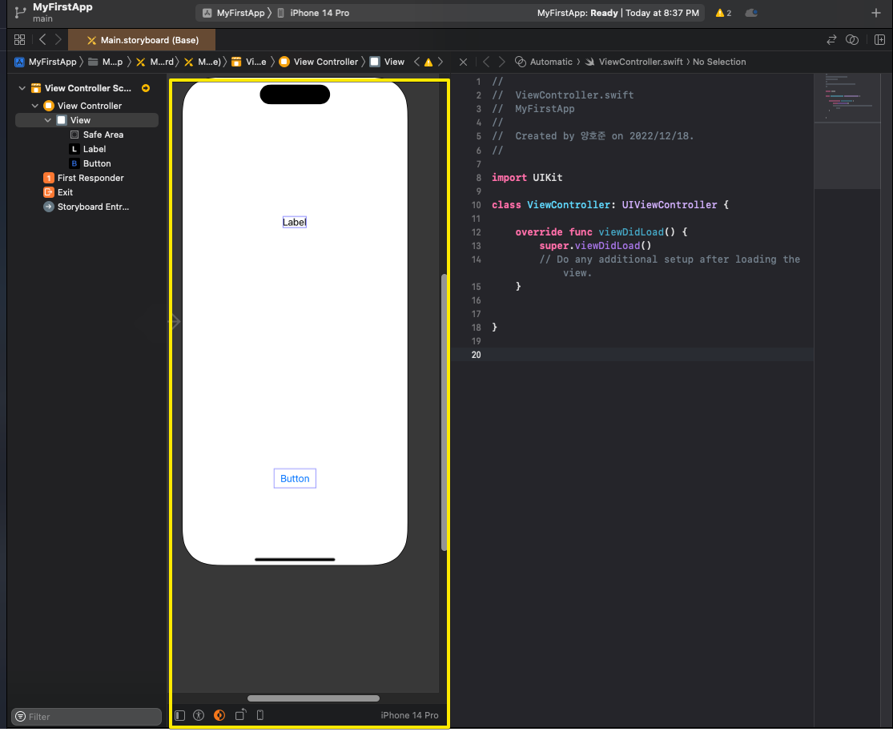
