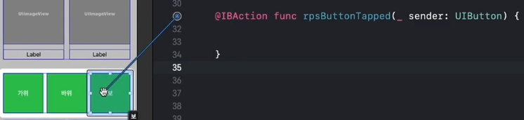

# (10) (앱 - 3: 가위바위보) 앱 만들기, 코드 설정하기 - 1

---

## 강의 reference

[앨런 Swift문법 마스터 스쿨 (온라인 BootCamp - 2개월과정)](https://www.inflearn.com/course/스위프트-문법-마스터-스쿨/dashboard)

---

 

### 참조

### 특징

### 1) outlet, action 위치

- viewDidLoad 위에 outlet, 아래에는 action 위치시키는 것이 관습적이고 일반적
- 클래스 안의 위치
  - 변수
  - 메서드
  - 위의 두개 순서대로 위치를 시키기 때문에, outlet, action의 위치가 위 / 아래로 보통 구현되는 것

### 2) 동일 버튼 연결

  
- action 버튼이 동일한 기능을 수행하는 경우, action의 연결 버튼을 다시 object로 끌어와서 연결 가능
- 한 함수로 동일한 동작을 하는 object를 연결할 수 있음

#### 같은 인자 구분
- sender로 구분
