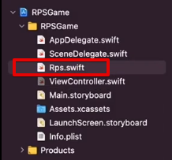

# (11) (앱 - 3: 가위바위보) 앱 만들기, 코드 설정하기 - 2

---

## 강의 reference

[앨런 Swift문법 마스터 스쿨 (온라인 BootCamp - 2개월과정)](https://www.inflearn.com/course/스위프트-문법-마스터-스쿨/dashboard)

---

<br>

### 참조

### 특징

### 1) viewDidLoad

- 앱 화면 들어오면, 로딩 완료 후 처음 실행되는 메서드

### 2) image 연결하기

- #imageLiteral 로 이미지 asset 그대로 가져오는 것이 가능!

```swift
override func viewDidLoad() {
  super.viewDidLoad()
  comImageView. image = "준비-주먹이미지"
  myImageView.image = UIImage (named: "ready.png")
}
```

### 3) 가위 / 바위 / 보



- Enum 타입으로 제한
- 새로운 파일로 만들고, 첫번째 대문자로 파일 이름 생성하고, 그 이름은 Enum의 name에 그대로 만드는게 일반적
- 코드, 데이터 영역에 그대로 들어감, 전역으로 영향을 미친다

### 4) 버튼 sender의 값 확인

- sender.currentSender을 확인!
- 에러가 출력되면
  - 버튼 style : default로 수정해야 함, 지금은 plain 타입이 기본형으로 되어있음~

### 5) Enum init

- init 생성시에 `rawValue`에 랜덤 int 넣어서 생성 시, 숫자 넣어주면 해당 state/값으로 세팅 가능
- 물론, 원시값 형태로 선언된 경우임!
