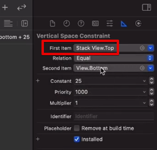
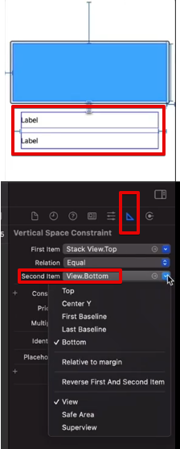
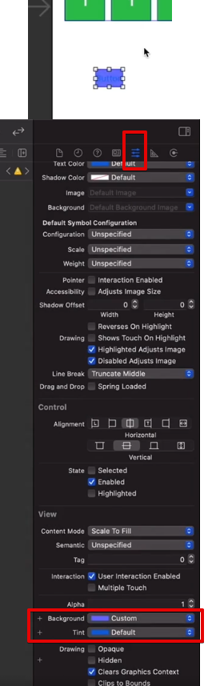

# (14) (앱 - 4: 업다운) 맥앱 만들기, 코드 설정하기

---

## 강의 reference

[앨런 Swift문법 마스터 스쿨 (온라인 BootCamp - 2개월과정)](https://www.inflearn.com/course/스위프트-문법-마스터-스쿨/dashboard)

---

 

### 참조

### 특징

### 1) ui-view object

- 선 생성 (얊게 펴놓으면)
- 볼 수 있는 박스 생성 가능! -> 테두리 + 배경까지 설정 가능한 Object

### 2) view 기준 수정

  

- 어디서 부터 띄워놓을 것인지 수정 가능...!

### 3) backgroud 수정, custom color

  
- 다양한 Preset 이쁜 컬러 색상들 사용 가능!
