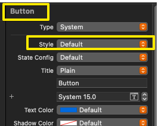
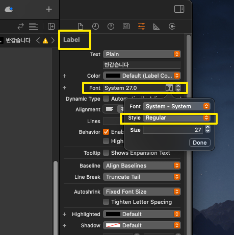
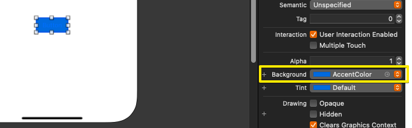
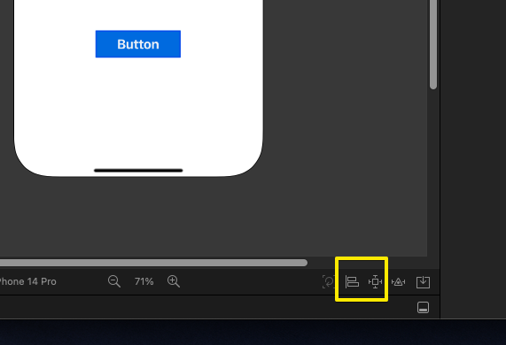
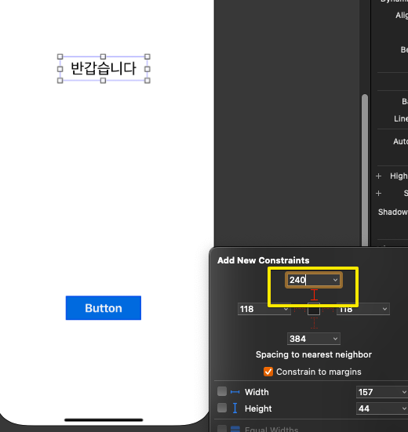
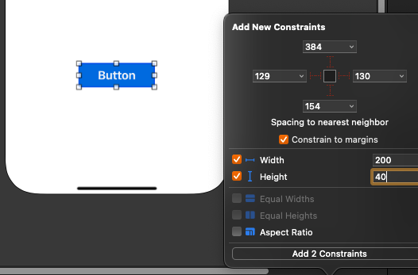
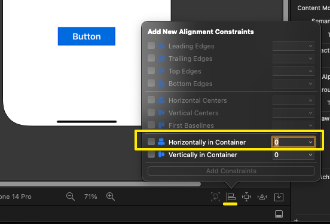
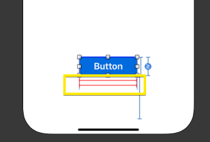
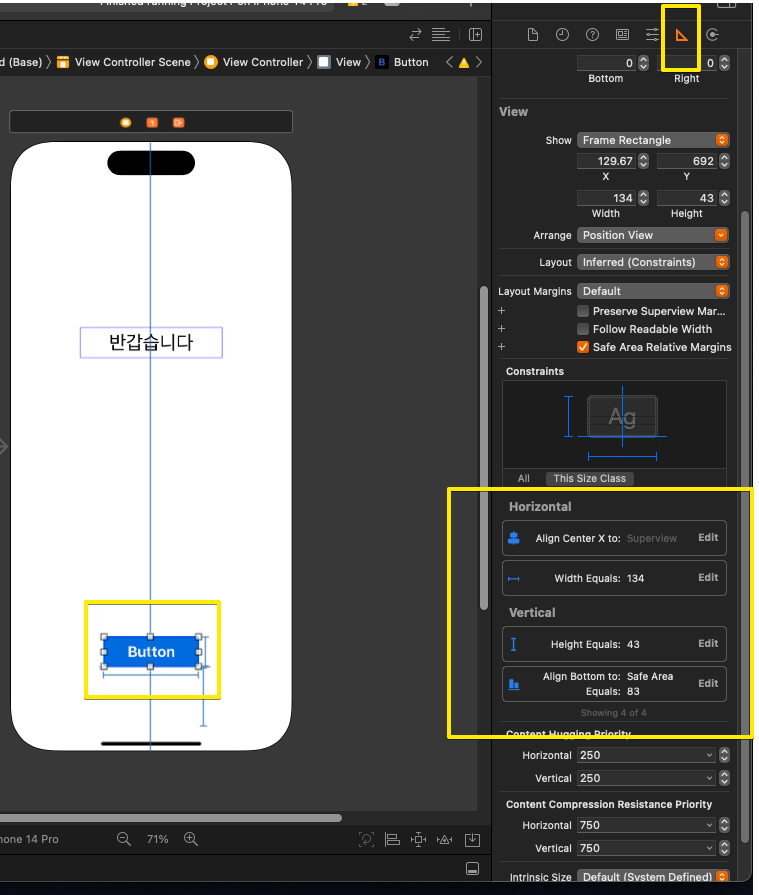
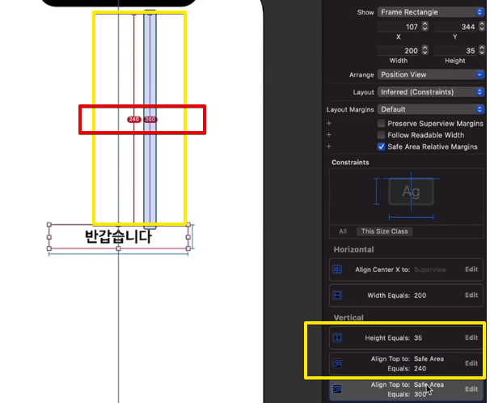

# 앱 만들기, 화면, 오토레이아웃 설정

---

## 강의 reference

[앨런 Swift문법 마스터 스쿨 (온라인 BootCamp - 2개월과정)](https://www.inflearn.com/course/스위프트-문법-마스터-스쿨/dashboard)

---

 

### 참조

### 특징

### 1) 반듯 취해야할 attribute 변경

1. object 선택
2. 속성 부분(Attributes Inspector)
3. Plain ====> Default로 변경

### 2) 폰트

### 3) 버튼 색

### 4) 비교

- Label : 글자만 표기
- Button : 클릭 가능한 버튼

### 5) 시뮬레이터

  
- 위 두개가 auto layout용 버튼
- 버튼은 오토 레이아웃을 해주어야 상대적으로 잘 버튼 위치가 잡힌다!

### 6) 오토레이아웃

  
  
- 빨간색이 나와야 함 -> 설정이 된 것이

 

  
- constraint 모자라는 경우, 센터 정렬 해야될 수도

 

  
- 설정 이후에, object asset 클릭에도 빨간 선 나오면 설정이 덜 된것 - 추가 constraint 설정을 해주어야할 수도

 

  
- 제약 확인 부분

 

  
- 제약 충돌나는 부분, 하나 선택해서 백스패이스로 삭제!
- or 그냥 기존 제약 바꾸려면, 해당 박스 더블클릭 -> 자세하게 바꾸는 화면으로 들어갈 수 있음
- or 그냥 edit 버튼 사용해서 값 변경!
