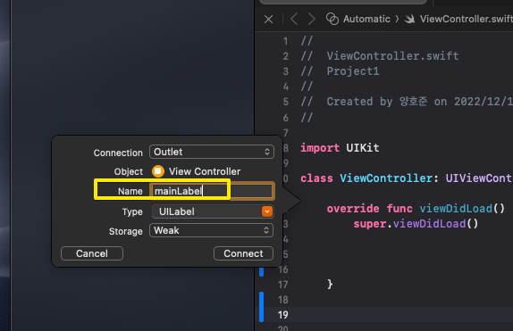

# (앱 - 1: 기초) 앱 만들기, 코드 설정하기

---

## 강의 reference

[앨런 Swift문법 마스터 스쿨 (온라인 BootCamp - 2개월과정)](https://www.inflearn.com/course/스위프트-문법-마스터-스쿨/dashboard)

---

<br>

### 참조

### 특징

### 1) assistant 켜기

  
- 필요한 코드 나란히 볼 수 있음

#### 화면 하나당 매칭되는(관리되는) 코드가 있음


- viewController는 지금 옆에 띄워진 화면임

<br>


- 이걸 선택하면 새로운 화면 작성 가능

#### view conroller 연결 확인


#### asset 코드로 연결하기

- control 버튼 누른 상태에서 assistance 영역으로 drag 하면 생성


### 2) 버튼 코드에 연결

#### 버튼 컨트롤로 가져오기



#### 연결 변수 이름만 설정(나머지는 기본으로 두기)


```swift
@IBOutlet weak var mainLabel: UILabel!
```

#### 버튼 추가 설정


- Type : UIButton
- Event : Touch Up Inside ; 이걸 해야 버튼 안에서 press되고 안에서 띄는 형식임
  - 99프로 TUI로 됨; 버튼이니깐!

```swift
    @IBAction func mainButtonPress(_ sender: UIButton) {

    }

```

- sender 파라미터로 받음; apple 관습
  - 버튼 이벤트 받는 것을 관습적으로 파라미터 sender로 받는다
  - 아마도, sender 계속 보면서 값 바뀌면 알게 하는 것일듯?

#### 버튼 연결 변경


- 이 탭에서 변경하면 됨
- 변수명 변경되면 이전 연결 삭제하고 다시 연결수행해주어야 오류 없음!

#### 버튼 텍스트 및 컬러 변경


- 위와 같이 타입 확인 가능, 같은 타입 넣어주어야 함(타입 언어면 당연!)
- `option + 변수 클릭` : 타입 확인할 수 있음!

#### 컬러 리터럴 넣는 방법

  


```swift
#colorLiteral
#imageLiteral
```

- 위를 입려하고 소괄호 열면 이미지 / 컬러 보면서 입력이 가능!

#### 텍스트 정렬

 
- 마찬가지로, option 누르고 타입 확인
