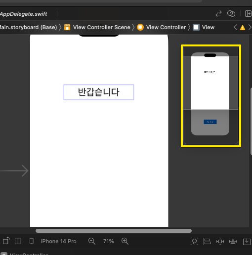

# (앱 - 1: 기초) 앱 만들기, 코드에 대한 자세한 설명

---

## 강의 reference

[앨런 Swift문법 마스터 스쿨 (온라인 BootCamp - 2개월과정)](https://www.inflearn.com/course/스위프트-문법-마스터-스쿨/dashboard)

---

<br>

### 참조

### 특징

### 1) attribute

- 컴파일러에게 추가 정보를 전달하는 것
- IB : interface builder
- Outlet : 정보 표현쪽
- Action : 사용자 Input 받는 부분

```swift
    @IBOutlet weak var mainLabel: UILabel!

    @IBAction func buttonPress(_ sender: UIButton) {
        mainLabel.text = "Hello my friend"
        mainLabel.backgroundColor = UIColor.yellow
        mainLabel.backgroundColor = #colorLiteral(red: 0.2588235438, green: 0.7568627596, blue: 0.9686274529, alpha: 1)
        mainLabel.textColor = #colorLiteral(red: 0.09019608051, green: 0, blue: 0.3019607961, alpha: 1)
        mainLabel.textAlignment = NSTextAlignment.right
    }

```

### 2) viewDidLoad

- 자바스크립트의 onWindowLoad 비슷한 개념인듯
- 화면이 로드 완료되고 첫 실행되는 함수

```swift
    override func viewDidLoad() {
        super.viewDidLoad()

    }
```

### 3) 어디까지가 코드인가


- 이 화면도 IDE에서 그려줄 뿐, 원래는 코드이다
- 지금 제어부만 따로 assistant 화면에서 코딩하는 것
