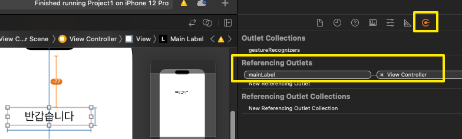
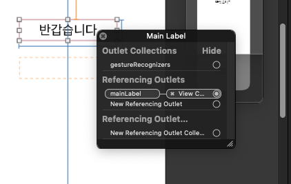
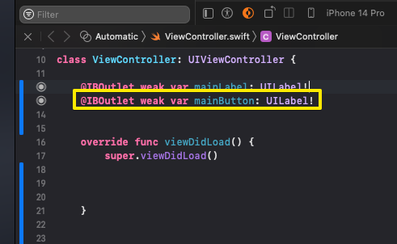

# (앱 - 1: 기초) 앱 만들기 , 추가적인 주의사항 설명

---

## 강의 reference

[앨런 Swift문법 마스터 스쿨 (온라인 BootCamp - 2개월과정)](https://www.inflearn.com/course/스위프트-문법-마스터-스쿨/dashboard)

---

 

### 참조

### 특징

### 1) 연결삭제

- 코드부분 삭제하고 싶으면, 스토리보드와의 연결 먼저 헤제하고 삭제해야 함

  

- 왼쪽에서 연결탭에서 보거나
- 오브젝트에 우클릭하면 확인 가능

### 2) 버튼 Outlet

- 버튼도 outlet으로 가져올 수 있다 -> 객체로 버튼 action 말고 버튼 자체 다루고자고 할 때
