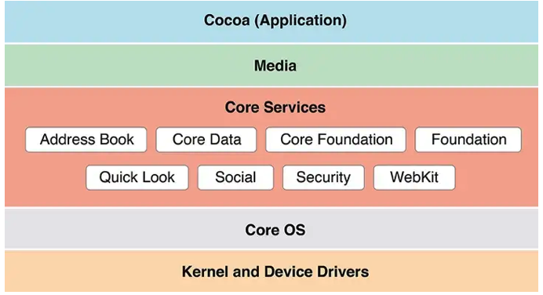

# iOS Architecture, Framework

---

## 강의 reference

[앨런 Swift문법 마스터 스쿨 (온라인 BootCamp - 2개월과정)](https://www.inflearn.com/course/스위프트-문법-마스터-스쿨/dashboard)

---

 

### 참조

### 특징

### 1) 프레임워크 & 라이브러리

- 프레임워크 : 개발이 종속적, 짜여진 룰에 따라 개발 진행
- 라이브러리 : 개발자가 필요시 가져와서 쓸 수 있음

#### UIKit

프레임워크임, 라이브러리도 import 가능!

- Foundation, AVFoundation 등의 프레임워크도 존재
  - Foundtaion은 다른 앱용 기능을 위한 프레임워크 / 라이브러리들이 존재!
    - Objective-C와 관련된 것들
    - 데이터, run-loop, multi-thread, timer, Network, Json ... 등등 다양한 기능들!
  - UIKit에는 Foundation이 들어있어서, UIKit만 import 해도 됨(?) -> 아마도?
    - 다른 4layer용은 Import 해서 사용해야됨!

### 2) 4 layers

https://vikaskore.medium.com/a-overview-of-ios-frameworks-79fa2d195694

