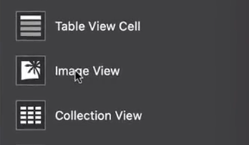
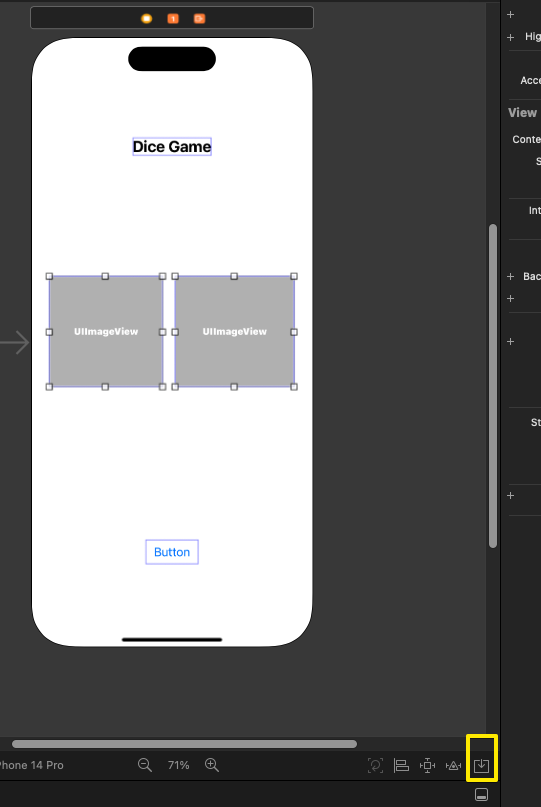
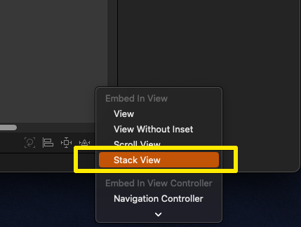
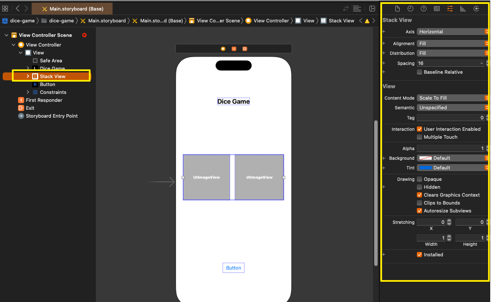
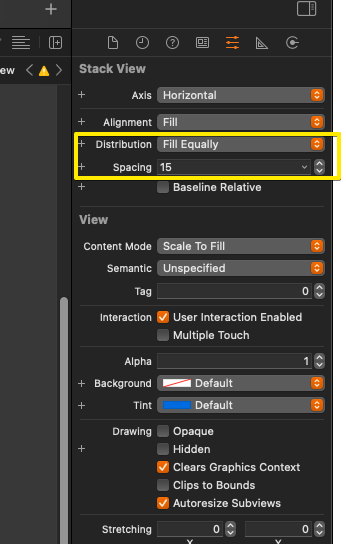
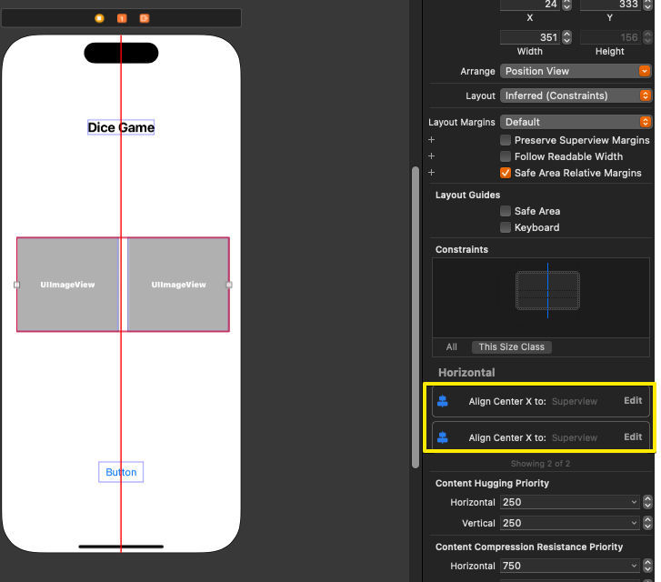
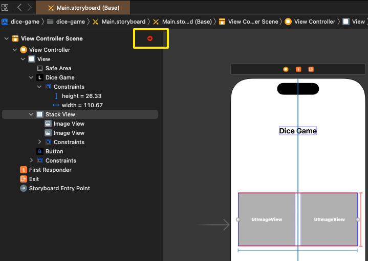
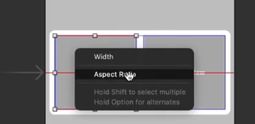

# (7) (앱 - 2: 주사위) 앱 만들기, 화면, 오토레이아웃 설정하기

---

## 강의 reference

[앨런 Swift문법 마스터 스쿨 (온라인 BootCamp - 2개월과정)](https://www.inflearn.com/course/스위프트-문법-마스터-스쿨/dashboard)

---

 

### 참조

### 특징

### 1) 새롭게 이미지 뷰 넣을 것

- objet 단축키 : command + shift + L

### 2) 가로 혹은 세로로 그리드 유지해야하는 그룹 있을 시

- Embbed in > stack view 사용

  

#### spacing & distribution

  

- spacing으로 공간 띄워주고, distribution으로 남은 길이 분배

### 3) 스택 뷰 잡아주기

- 센터 2개 맞추기
  
- 여기서 필요한 constraints 추가로 확인할 수 있음(빨간색 표시가 되면)
  
- aspect ratio를 이미지 안에서 잡아도 됨
