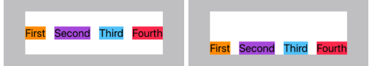
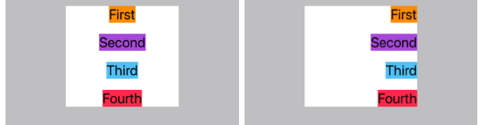
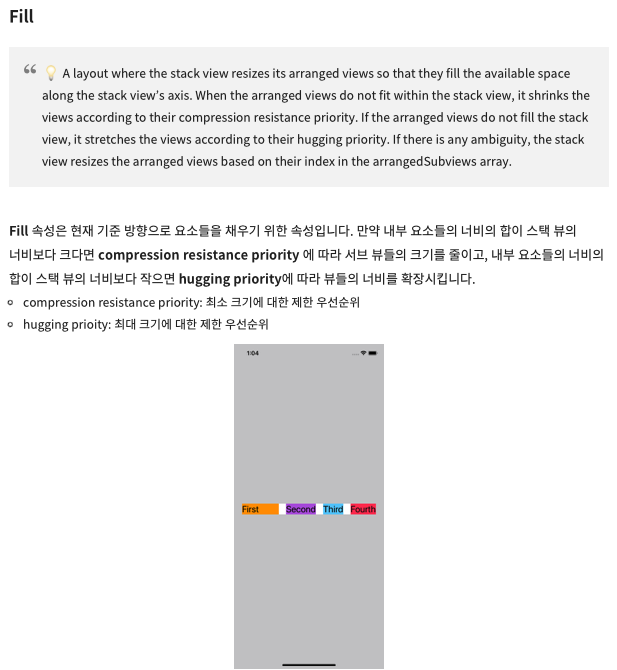

# (앱 - 3: 가위바위보) 앱 만들기,화면, 오토레이아웃 설정하기

---

## 강의 reference

[앨런 Swift문법 마스터 스쿨 (온라인 BootCamp - 2개월과정)](https://www.inflearn.com/course/스위프트-문법-마스터-스쿨/dashboard)

---

 

### 참조

### 특징

#### alignment + distribution

  
https://jeonyeohun.tistory.com/195

##### 기본

##### axis

##### spacing

##### alignment

  
  
  
  
  
  

##### distribution

  
  

### 1) Label + UIImage + Label -> Stack view

- stack 2개도 사용 가능!

### 2) spacing 기준 변경법

