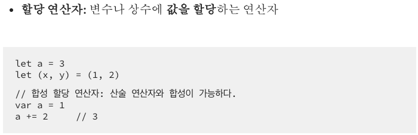
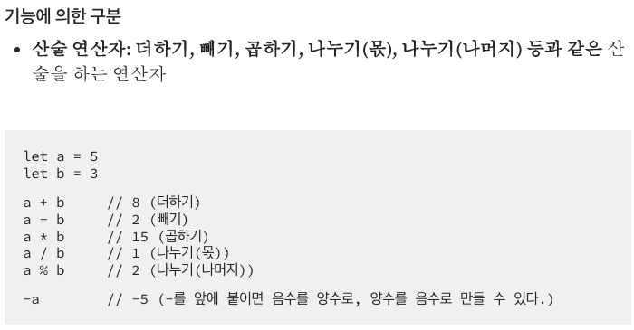
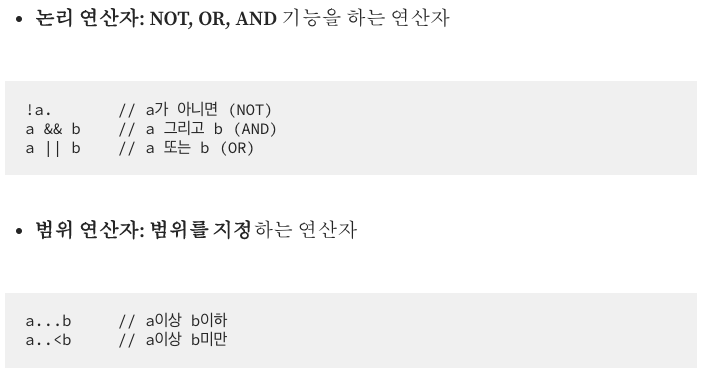
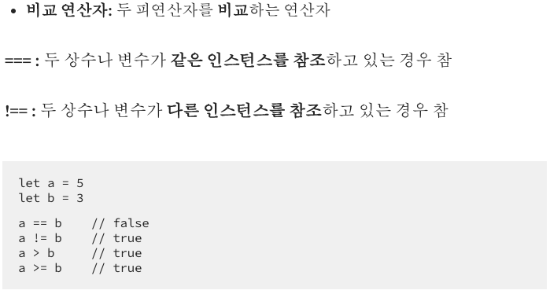
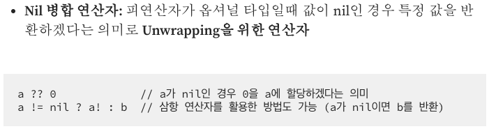

# 기본연산자

---

## 강의 reference

[앨런 Swift문법 마스터 스쿨 (온라인 BootCamp - 2개월과정)](https://www.inflearn.com/course/스위프트-문법-마스터-스쿨/dashboard)

---

 

### 1) 연산자

- 단항연산; -a, +a, !a, a... 등
- 이항연산; 비교, 덧셈 등등
- 삼항연산; JavaScript 삼항 연산자와 동일!

---

[블로그 참조 링크](https://medium.com/@jgj455/%EC%98%A4%EB%8A%98%EC%9D%98-swift-%EC%83%81%EC%8B%9D-custom-operator-generic-58e783742b)

### 2) 할당 연산자

- 문장, 변수에 리터럴 할당하는 것 등

### 3) 산술 연산자

- 4칙 연산 등 주로 이항연산
- / 이 몫이 나오고, double/float 형태가 아님을 주의! (`정수 연산인 경우`)

### 4) 논리 & 범위 연산자

- 범위연산자 ~= 접근 연산자라고도 함
  -

### 5) 비교 연산자와

### 6) nil 병합 연산자

### 7) 기타

- 당연하게도, 같은 타입에 대해서만 연산이 가능!
- 나눗셈 연산시 0 division 및, double/float 연산을 원한다면 제수 피제수도 모두 double/float로 구현해야 함
